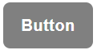

# Components

## Buttons

Use Equipe's custom Ebtn component for actions in forms, dialogs, and more. Includes support for a handful of contextual variations, sizes, states, and more.

## 

### Overview

BootstrapVue's Ebtn component generates either a "button" element, "a" element, or "router-link" component with the styling of a button.

`<Ebtn>Button</Ebtn>` 
`<Ebtn variant="danger">Button</Ebtn>` 
`<Ebtn variant="success">Button</Ebtn>` 
